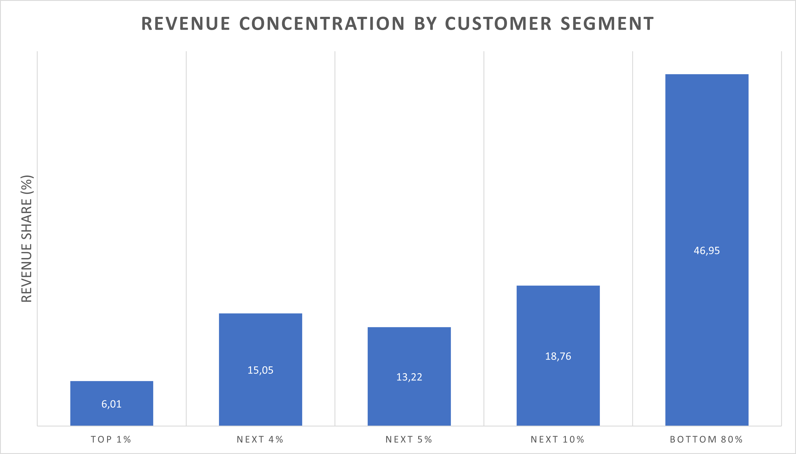
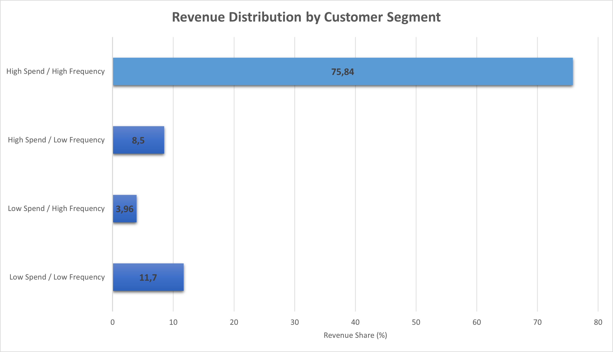
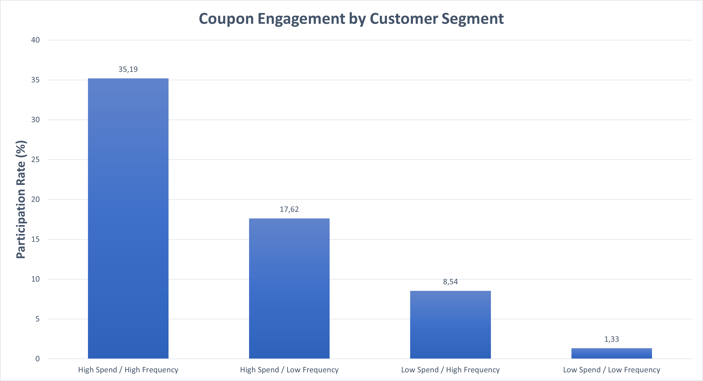
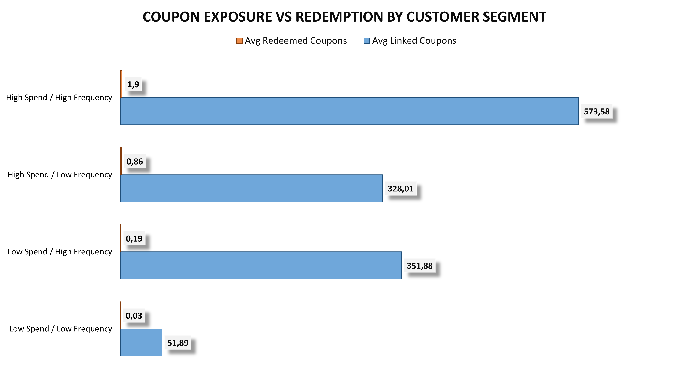

# 🛒 Dunnhumby Retail Analysis

---

## 🧠 Overview

This project analyzes customer behavior, product performance, coupon usage, and campaign effectiveness using the Dunnhumby retail dataset.

The objective is to understand how revenue is distributed, how customers respond to promotions, and whether marketing efforts drive meaningful engagement.

---

## 🎯 Business Questions

- How is revenue distributed across customers?
- Which customer segments drive the business?
- Do coupons influence customer behavior?
- Are campaigns effective or reinforcing existing habits?

---

## 🗂 Dataset

The dataset includes:

- `transaction_data` → product-level purchases  
- `product` → product attributes (category, brand)  
- `hh_demographic` → customer information  
- `coupon`, `coupon_redempt` → coupon distribution and usage  
- `campaign_table`, `campaign_desc` → campaign targeting  

---

## ⚙️ Tools Used

- SQL (PostgreSQL, DBeaver)  
- Excel (visualization)  

---

## 📦 Project Structure

### SQL Scripts
- `01_create_tables.sql`
- `02_load_data.sql`
- `03_data_audit.sql`
- `04_join_validation.sql`
- `05_customer_analysis.sql`
- `06_product_analysis.sql`
- `07_coupon_analysis.sql`
- `08_campaign_analysis.sql`

### Visualizations
- `revenue_concentration.png`
- `revenue_distribution_by_customer_segment.png`
- `coupon_engagement_by_customer_segment.png`
- `coupon_exposure_vs_redemption.png`

---

# 🔍 Key Insights

---

## 📊 Revenue Concentration

To understand how dependent the business is on its customers, we analyze how revenue is distributed across customer groups.

Revenue is unevenly distributed:

- Bottom 80% contribute ~47% of total revenue  
- Top segments generate a significant share  

👉 The business relies heavily on higher-value customers.

---

## 📊 Revenue Distribution by Customer Segment

We segment customers based on spend and shopping frequency to identify key contributors.

- High Spend / High Frequency customers generate ~75%+ of revenue  
- Other segments contribute significantly less  

👉 Retaining top customers is critical, while growth depends on improving mid-tier segments.

---

## 📊 Coupon Engagement by Customer Segment

To evaluate engagement, we measure how many customers in each segment actually redeem coupons.

- High-value customers show the highest participation (~35%)  
- Lower-value segments show minimal engagement  

👉 Coupons are primarily used by already active customers.

---

## 📊 Coupon Exposure vs Redemption

To assess promotion effectiveness, we compare how many coupons customers receive versus how many they redeem.

- Customers receive hundreds of coupons on average  
- Actual redemption is extremely low (close to 0–2 per customer)  

👉 High exposure does not translate into meaningful customer action.

---

# 📌 Conclusions

- Revenue is concentrated in a small group of customers  
- Coupons are widely distributed but rarely used  
- Campaigns reinforce existing behavior rather than drive change  
- Lower-value customer segments remain largely inactive  

---

# 🚀 Recommendations

- Focus on retaining high-value customers  
- Improve targeting of mid-value segments  
- Reduce excessive coupon distribution and increase relevance  
- Design campaigns aimed at behavior change, not just retention  

---

# ⚠️ Limitations

- Coupon redemption cannot be fully attributed to campaigns  
- No control group → causal impact cannot be measured  
- Some fields (e.g., quantity) contain outliers and were excluded  

---

# 👤 Author

**Stanislav Patlakha**  
Aspiring Data Analyst  

GitHub: https://github.com/Last-to-say
